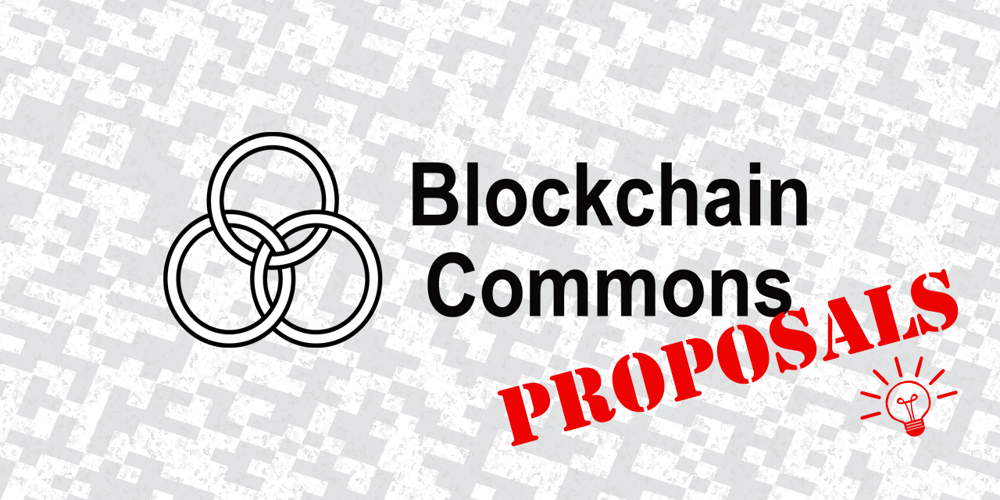

# Blockchain Commons Proposals

BCPs are Blockchain Commons Proposals, meant to promte open, interoperable, secure & compassionate digital infrastructure. These are still not standards, but they are more mature that our [BCR Research papers](https://github.com/BlockchainCommons/Research/blob/master/README.md) and/or have been deployed within a wider community. BCRs usually become BCPs if they meet at least one of two criteria:

* Two or more companies have implemented a BCR.
* Blockchain Commons feels that they have matured and are ready to advance.

In addition, any conflicts with existing standards must be understood, considered worthwhile, and clearly discussed when a BCR is promoted.

When a BCR becomes a BCP, we:
* Consider the community to have become an important part of the conversation.
* Consider them to be viable candidates for further standardization.

A BCP may still be fluid, but there will be community discussion for changes and generally a community-oriented process for continuing to expand the proposals. The ultimate goal is to specify, setup, and mature these Proposals, and thereafter turn them over to another authority, possible as a [BIP](https://github.com/bitcoin/bips), an [IETF draft](https://www.ietf.org/standards/ids//), or  a [W3C standard](https://www.w3.org/standards/). (Requirements from a standards body are one of the main reasons that a BCP may require changes, even breaking changes, as was the process when Gordian Envelope became an IETF Internet Draft.)

This directory includes all documents that have matured and/or that have been turned over to standards or pre-standards organizations, with the latter also including [Rebooting the Web of Trust](https://www.weboftrust.info/). 

## BCP

See [Promotion](PROMOTION.md) for the administrative tasks to update a BCR to a BCP.

To create a BCP, first please consult the [BCP template](bcp-2020-001.md), which is BCP #2020-001.

To contribute your BCP using the template format, you can fork the repo, add the appropriate files, then submit a PR. For the core BCP file, please use the format `bcp-YYYY-SSS.md` for the file name, where `YYYY` and `SSS` match the current year and next sequence number, per "BCP Numbering", below.

If additional documentation is required, please PR a matching directory (e.g., a directory called `bcp-2020-001` for `bcp-2020-001.md`) with the documents as contents.

Please also add your BCP to the "BCP Listing" below.

_All contributions to this repo require a [Signed Contributor License Agreement](CLA.md) (which will be needed if we submit to other organizations like IETF, W3C, Linux Foundation, etc.)._

### BCP Listing

| Number                    | Title         | Version | Org. | Owner                                                  | Type          | Status   |
|---------------------------|---------------|---------|-----|----------------------------------------------|---------------|----------|
| [BCP-2020-001](bcp-2020-001.md) | BCP Template | 0.1.0 | | Christopher Allen | Process | Draft |

_Also see our [Research](https://github.com/BlockchainCommons/Research/blob/master/README.md) and our [Testimony](https://github.com/BlockchainCommons/Testimony/blob/master/README.md)._

Please feel free to submit a PR to request the advancement of a _BCR Work Item_ to a _BCP_ if it meets the criteria of two or more companies have implemented the BCR. Simply follow the administrative steps for [Promotion](PROMOTION.md). If a BCR does not have two-company commitment, but you think it's sufficiently mature and/or important, please [contact us](mailto:team@blockchaincommons.com).

### BCP Number

Please number all BCPs with a four-digit number representing the current year (`YYYY`) followed by a three-digit sequence number for that year (`SSS`). For example: `bcp-2020-001` is the first BCP for 2020, `bcp-2020-017` is the 17th, and `bcp-2021-001` is the first BCP for 2021.

_Note that the sequence number reverts to 001 at the start of each year._

### BCP Title

Please be sure that your title is concise, yet informative.

### BCP Version

When updating BCPs, please use [semantic versioning](https://semver.org/) for your version number.

Most briefly: your version number should be of the form X.Y.Z, where `X` is the major number ("0" for a BCP in progress; "1" for a fully drafted BCP; and "2" or higher for a new version that has introduced a backward-incompatible change), `Y` is the minor number (for a backward-compatible new feature), and `Z` is the patch number (for fixing typos and making other clarifications that don't fundamentally change what the BCP means).

But please consult the semantic versioning document for more information and adjust appropriately for the fact that these are textual BCPs, not software.

### BCP Owner

Please list the person primarily responsible for the BCP, and moving it forward, as the owner. If there are multiple authors, they should be listed on the BCP itself, not on this overview.

### BCP Type

BCP use the same standard statuses used on most other \*IPs (such as BIPs and SLIPs):

   * *Process* — An internal document for our own usage.
   * *Standards* — A BCP eventually intended to move onto a standards track, such as a BIP, IETF, or W3C.
   * *Informational* — A BCP discussing a wallet issue without explicitly proposing a new feature.

### BCP Status

BCPs move through much the same process as other \*IPS, with the exception that after finalization we expect them to move onto another track:

   * *Work Item* — A major BCR or BCP draft that has been accepted by BC for further work.
   * *Mature* — A BCP draft that has been fully matured and that we feel is ready for the next step.
   * *Submitted* — A BCP draft that has been submitted to another standards body. (The precise body should be listed as part of this status)
   * *Deprecated* — A BCR or BCP draft that has been superseded by another draft.
     
## Origin, Authors, Copyright & Licenses

Unless otherwise noted (either in this [/README.md](./README.md) or in the file's header comments) the contents of this repository are Copyright © 2020 by Blockchain Commons, LLC, and are [licensed](./LICENSE) under the [spdx:BSD-2-Clause Plus Patent License](https://spdx.org/licenses/BSD-2-Clause-Patent.html).

In most cases, the authors, copyright, and license for each file reside in header comments in the source code. When it does not, we have attempted to attribute it accurately in the table below.

### Derived from…

This project is inspired by [BIPs](https://github.com/bitcoin/bips), [EIPs](https://github.com/ethereum/EIPs), and [SLIPs](https://github.com/satoshilabs/slips). It uses their formatting and templates as inspiration, to create more cross-compatible proposals.

### Used with…

These are other projects that work with or leverage `$projectname`:

- [community/repo-name/](https://github.com/community/repo-name) — Repo that does what, by [developer](https://github.com/developer)  or from  [community](https://community.com).

## Financial Support

*WIPs* is a project of [Blockchain Commons](https://www.blockchaincommons.com/). We are proudly a "not-for-profit" social benefit corporation committed to open source & open development. Our work is funded entirely by donations and collaborative partnerships with people like you. Every contribution will be spent on building open tools, technologies, and techniques that sustain and advance blockchain and internet security infrastructure and promote an open web.

To financially support further development of `$projectname` and other projects, please consider becoming a Patron of Blockchain Commons through ongoing monthly patronage as a [GitHub Sponsor](https://github.com/sponsors/BlockchainCommons). You can also support Blockchain Commons with bitcoins at our [BTCPay Server](https://btcpay.blockchaincommons.com/).

## Contributing

We encourage public contributions through issues and pull requests! Please review [CONTRIBUTING.md](./CONTRIBUTING.md) for details on our development process. All contributions to this repository require a GPG signed [Contributor License Agreement](./CLA.md).

### Discussions

The best place to talk about Blockchain Commons and its projects is in our GitHub Discussions areas.

[**Gordian Developer Community**](https://github.com/BlockchainCommons/Gordian-Developer-Community/discussions). For standards and open-source developers who want to talk about interoperable wallet specifications, please use the Discussions area of the [Gordian Developer Community repo](https://github.com/BlockchainCommons/Gordian-Developer-Community/discussions). This is where you talk about Gordian specifications such as [Gordian Envelope](https://github.com/BlockchainCommons/Gordian/tree/master/Envelope#articles), [bc-shamir](https://github.com/BlockchainCommons/bc-shamir), [Sharded Secret Key Reconstruction](https://github.com/BlockchainCommons/bc-sskr), and [bc-ur](https://github.com/BlockchainCommons/bc-ur) as well as the larger [Gordian Architecture](https://github.com/BlockchainCommons/Gordian/blob/master/Docs/Overview-Architecture.md), its [Principles](https://github.com/BlockchainCommons/Gordian#gordian-principles) of independence, privacy, resilience, and openness, and its macro-architectural ideas such as functional partition (including airgapping, the original name of this community).

[**Blockchain Commons Discussions**](https://github.com/BlockchainCommons/Community/discussions). For developers, interns, and patrons of Blockchain Commons, please use the discussions area of the [Community repo](https://github.com/BlockchainCommons/Community) to talk about general Blockchain Commons issues, the intern program, or topics other than those covered by the [Gordian Developer Community](https://github.com/BlockchainCommons/Gordian-Developer-Community/discussions) or the 
[Gordian User Community](https://github.com/BlockchainCommons/Gordian/discussions).
### Other Questions & Problems

As an open-source, open-development community, Blockchain Commons does not have the resources to provide direct support of our projects. Please consider the discussions area as a locale where you might get answers to questions. Alternatively, please use this repository's [issues](./issues) feature. Unfortunately, we can not make any promises on response time.

If your company requires support to use our projects, please feel free to contact us directly about options. We may be able to offer you a contract for support from one of our contributors, or we might be able to point you to another entity who can offer the contractual support that you need.

### Credits

The following people directly contributed to this repository. You can add your name here by getting involved. The first step is learning how to contribute from our [CONTRIBUTING.md](./CONTRIBUTING.md) documentation.

| Name              | Role                | Github                                            | Email                                 | GPG Fingerprint                                    |
| ----------------- | ------------------- | ------------------------------------------------- | ------------------------------------- | -------------------------------------------------- |
| Christopher Allen | Principal Architect | [@ChristopherA](https://github.com/ChristopherA) | \<ChristopherA@LifeWithAlacrity.com\> | FDFE 14A5 4ECB 30FC 5D22  74EF F8D3 6C91 3574 05ED |

## Responsible Disclosure

We want to keep all of our software safe for everyone. If you have discovered a security vulnerability, we appreciate your help in disclosing it to us in a responsible manner. We are unfortunately not able to offer bug bounties at this time.

We do ask that you offer us good faith and use best efforts not to leak information or harm any user, their data, or our developer community. Please give us a reasonable amount of time to fix the issue before you publish it. Do not defraud our users or us in the process of discovery. We promise not to bring legal action against researchers who point out a problem provided they do their best to follow the these guidelines.

### Reporting a Vulnerability

Please report suspected security vulnerabilities in private via email to ChristopherA@BlockchainCommons.com (do not use this email for support). Please do NOT create publicly viewable issues for suspected security vulnerabilities.

The following keys may be used to communicate sensitive information to developers:

| Name              | Fingerprint                                        |
| ----------------- | -------------------------------------------------- |
| Christopher Allen | FDFE 14A5 4ECB 30FC 5D22  74EF F8D3 6C91 3574 05ED |

You can import a key by running the following command with that individual’s fingerprint: `gpg --recv-keys "<fingerprint>"` Ensure that you put quotes around fingerprints that contain spaces.
